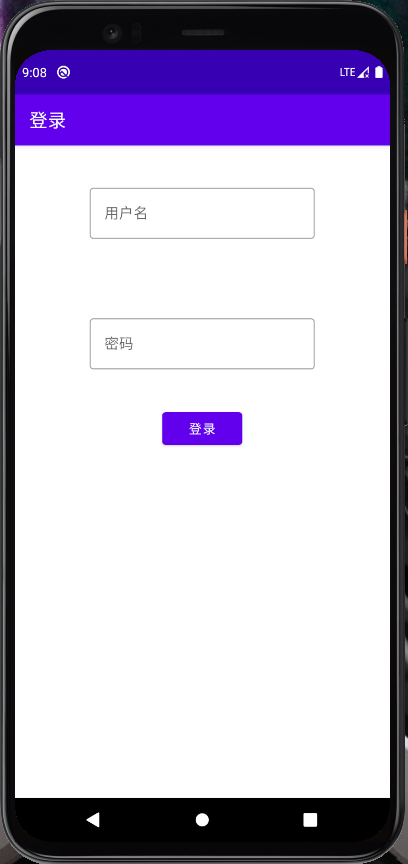
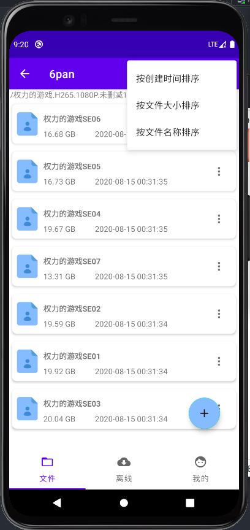
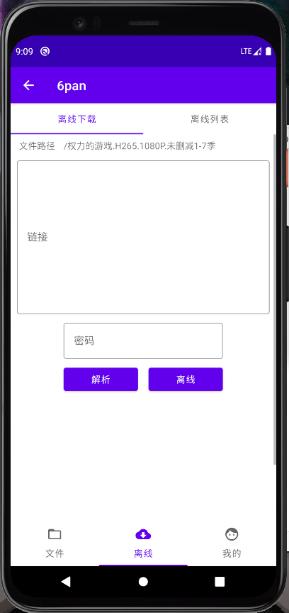
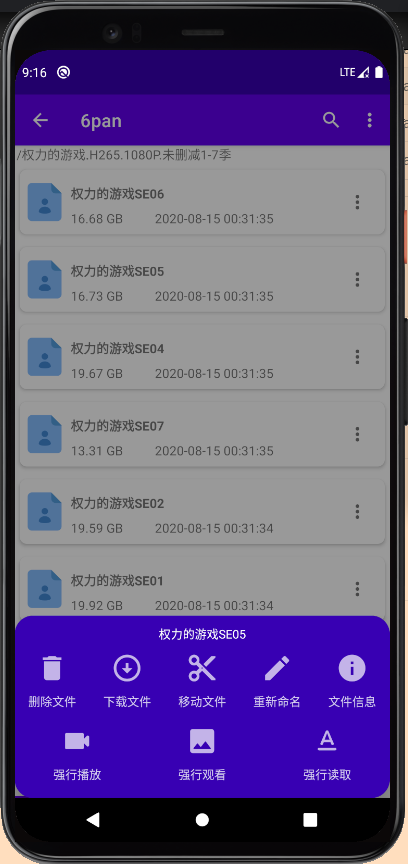

# nap6

一个自用的 [6盘](https://2dland.cn/) 非官方 Android 客户端

# 功能

 登录、退出

文件浏览

新建文件夹

移动、删除、查询文件

图片查看

视频查看

简单的投屏

文本查看(小于1m)

离线文件

离线列表查看

获取文件下载地址

# BUG
离线下载到根目录时，下载完成不提示(已修复，但没更新)

搜索状态下，全选会选择当时目录下的文件而非搜索出的文件

全选文件时，位置会移动(已修复，但没更新)

# 下载

https://github.com/zerorooot/nap6/releases/

# 预览

登录

文件列表

离线下载

我的

更多

视频播放(**仅支持arm64位的手机**)

# 感谢

感谢[Rn6Pan](https://github.com/hjthjthjt/Rn6Pan)，本项目的部分图标、页面~~抄袭~~借鉴了ta的

